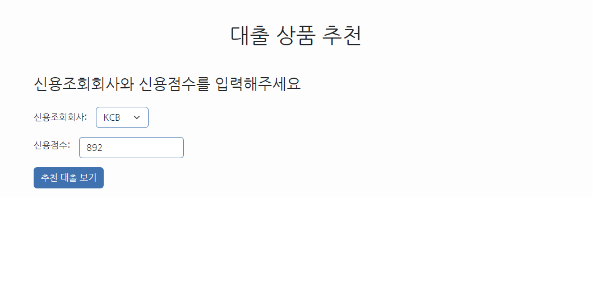

# 금융상품 추천 서비스 ReccoMate

## 1. 팀원정보 및 업무 분담 내역

조원 : 차재훈, 권대형

기획하는 단계에서 철저하게 역할을 나누고 시작하진 않았다. 팀원 모두 django와 vue를 어느정도 다룰 줄 아는 상태였기 때문에 그때그때마다 아직 구현하지 않은 기능들을 하나씩 맡아서 구현을 했다. 또한 꽤 오랜 기간동안 같이 옆자리에서 공부를 한 사이이기 때문에 에러나 버그가 생기는 등의 문제가 있을 경우 서로에게 물어보는 것이 익숙해 기능 구현을 하다 막힐 경우 같이 해결해 나가며 프로젝트를 완성했다. 마무리 단계에서 대형이 Vue의 style을 전반적으로 담당하고, 재훈이 상품 추천 알고리즘, chatbot 제작 등을 맡은 것을 제외하곤 나머지 부분은 대부분 같이 했다고 보면 된다.

## 2. 설계 내용 및 실제 구현 정도

**_첫 회의 구상 내용_**

첫 회의때부터 우리는 목표 자체를 빠르게 기능들을 구현한 뒤, 추가적인 기능들을 그 후에 구현하는 것으로 잡았다. CSS는 둘 다 완벽히는 할 수 없다고 생각했기 때문에 최대한 깔끔하게만 보이게 하려고 노력했다. 1.예적금 비교, 2.환율 계산기, 3.집 주변 은행 검색, 4.게시판, 5.프로필&추천 알고리즘 구현은 프로젝트 시작 후 4~5일 내로 최대한 빠르게 끝냈고, 그 이후에 1.챗봇 제작, 2. 욕설 필터링, 3. 대출상품 추천 등 추가적인 기능들을 기존 기능들을 보완해 가며 구현했다.

## 3. 데이터베이스 모델링

대출 상품 추천을 구현하기 위해 Loan Model들이 추가된것 의외에는 초기 설계때와 바뀐 부분이 없다. 기본적인 User 모델과, 금융 상품들의 정보를 저장할 Deposit(예금), Saving(적금), Loan(대출) Model들이 포함돼있다.

## 4. 금융 상품 추천 알고리즘에 대한 기술적 설명

### 1. 다른 유저들의 데이터를 활용한 예금 상품 추천

   

- 첫번째 알고리즘으론 10000개의 유저 더미데이터를 활용해 나이, 연봉, 자산등이 비슷한 다른 사용자들이 이미 가입해있는 products들을 추천해주는 알고리즘이다.
- 현재 로그인한 유저의 정보와 10% 이내의 값을 갖는 다른 유저가 이미 가입한 상품들을 heapq에 넣어, 10번 heappop을 해 10개의 상품을 추천하게 구현했다.
- 현재 유저와 다른 유저의 정보가 더 비슷할수록 가중치를 두게 하였다. ex) 나이, 연봉, 자산이 모두 10% 이내일 경우 그 product는 3번 넣는 방식

### 2. ai기반 챗봇

   

- Openai를 이용하여 챗봇을 구현했다. 참고 : <https://wikidocs.net/201617>
- Openai 에게 전체 prompt를 입력하고, 유저가 대화를 하면 그 prompt에 그 메세지를 추가해 챗봇이 답을 할때마다 전체 prompt를 읽게 하였다. 
- 챗봇에게 예금 상품들의 정보와, 사용자에게 친근한 이미지를 주기 위해 적절한 어투, 이모티콘 사용 등의 메세지들을 prompt에 저장해두고 시작했다.
- 이것도 back에서 ai를 갖고 놀아보는건 어렵지 않았다. 고양이 캐릭터 이미지와 front 구현이 어려운 면이 있었다.

### 3. 추가기능 - 신용등급을 이용한 대출 상품 추천

- 신용조회 회사와 신용 점수를 입력할 경우 자동으로 신용 등급을 계산하여 가장 금리가 낮은 상품을 추천해주는 기능이다.
- 또한 그 은행의 다른 상품을 갖고있을 경우 금리에 이점을 주는 '가감조정금리' 를 따로 보여주기 위해 은행별로 가장 가감조정금리가 가장 낮은 상품들을 추천하게 하였다.
- 기준금리가 가장 낮은 상품은 heapq를 이용해 금리가 가장 낮은 하나만 heappop하여 vue에 넘겨주었고, 가감조정금리가 가장 낮은 상품들은 리스트를 탐색하여 같은 은행일 경우 금리를 비교하여, 더 낮을 경우 리스트에 넣도록 하여 은행별로 금리가 가장 낮은 상품만 리스트에 남게 하였다. 다만 이 부분은 은행의 목록을 내가 알고있기 때문에 더 효율적으로 구현할 수 있을 것 같다.

  

## 5. 서비스 대표 기능들에 대한 설명
### 0. 메인 페이지

메인페이지다. Reccomate에 대한 간단한 설명을 제공하고, carousel을 클릭할 경우 해당하는 서비스로 바로 이동할 수 있게 할 수 있게 하였다. 
### 1. 환율 계산기

화폐별로 환율을 자동으로 계산해주는 계산기이다. 외화에 값을 넣든, 원화에 값을 넣든 자동으로 반대편의 값이 계산돼 나온다.

### 2. 은행 지도

시/구/은행을 선택할 경우 그 지역의 특정 은행들의 위치를 알려주는 기능이다. 만약 지도를 움직일 경우 원래 지역으로 돌아가기/ 현재 위치에서 특정 은행 검색 등의 기능을 제공한다.

### 3. 게시판

게시판이다. 글 작성/삭제/수정, 댓글 작성/삭제/수정이 가능하다.
욕설 필터링 기능이 포함되어 있다.

게시글, 혹은 댓글에 욕설을 적을 경우에 해당 단어는 "**" 으로자동으로 필터링을 해준다.

만약 3번 욕설을 할 경우, 해당 회원은 자동으로 회원탈퇴되며, "탈퇴한 유저"로 바뀌게 된다.

### 4. 예&적금

예금 & 적금 열람 기능이다. 은행별로 필터링, 개월수 별로 금리 오름차순, 내림차순 정렬 기능, 예&적금 상세 페이지 기능을 제공한다.

### 5. 프로필 페이지(가입한 상품 분석 차트, 상품 추천)

가입한 상품을 금리별로 분석하는 차트, 예금 추천, 대출 추천 기능을 제공한다. 예금 추천 기능은 현재 사용자의 나이, 자산, 연봉과 비슷한 다른 이용자들이 많이 가입한 예금 상품들을 추천해준다. 대출 추천 기능은 입력된 신용점수를 통해 신용등급을 자동으로 계산해 기준금리 기준으로 가장 금리가 낮은 상품 1개를 추천해주며, 그 은행의 다른 상품을 갖고 있을 경우 적용되는 가감조정금리를 기준으로 각 은행당 가장 금리가 낮은 상품들을 1개씩 추천해준다.

## 6. 느낀점, 후기

- 재훈 : 사실 비전공자 출신이기 때문에 웹 사이트를 협업하여 제작하는 것은 처음 해보는 경험이였다. 그래서 싸피 1학기 초에는 학기말에 프로젝트를 진행한다는 사실을 알고 막연히 두려움을 갖기도 했다. 하지만 다행히도 친한 동생과 같이 할 수 있게 되기도 했고, 프로젝트의 내용 자체도 충분히 내가 할 수 있는 범위 내에 있다고 생각이 들었기 때문에 나름 즐겁게 프로젝트를 진행할 수 있었다. 특히 고맙게도 대형이가 정말 열심히 하기도 했고, 내가 부족한 front의 style부분을 스스로 맡아서 해주었기 때문에 내가 잘 할 수 있는 부분에 집중할 수가 있었다. 앞으로 SSAFY에서의 2학기나, 현업에 들어가서도 다른 사람들과 협업하여 프로젝트를 많이 진행하게 될텐데, 이 관통 프로젝트를 진행한 경험이 아주 큰 도움이 될 것 같다는 생각을 한다. 또한 사람간의 관계를 중요시 하는 나로썬 역시 같이 일하는 사람과의 관계가 아주 중요하다는 것을 이 마지막 관통 프로젝트가 다시 깨닫게 해주었던 것 같다.

- 대형 :처음에는 일주일이라는 기간이 길지 않게 느껴져서 둘이 협업이라고 해도 기간 안에는 어려울 것이라고 생각했었다.
  하지만 차근차근 하다 보니 필수 기능에서 나아가 몇몇 추가 기능들도 추가할 수 있었고, 과거 혼자 실습하면서 들인 시간에
  비해 서로 도와가며 구현해서 그런지 효율적으로 시간을 쓸 수 있어서 좋았다. 또한 자유롭게 의견을 교환하면서 기능들을
  생각하고, 그 기능들을 구현하다보니 여러 자료들을 살펴보게 되고, 그에 따라 개발적인 역량도 조금은 성장한 것 같아
  만족스럽다.
